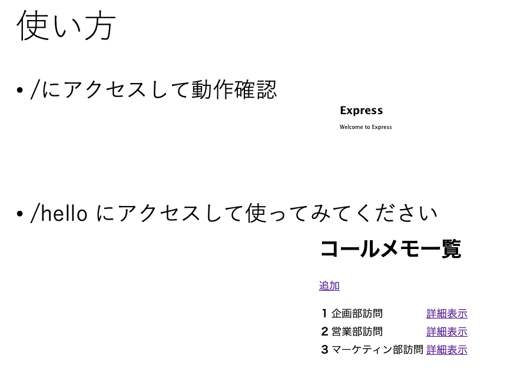
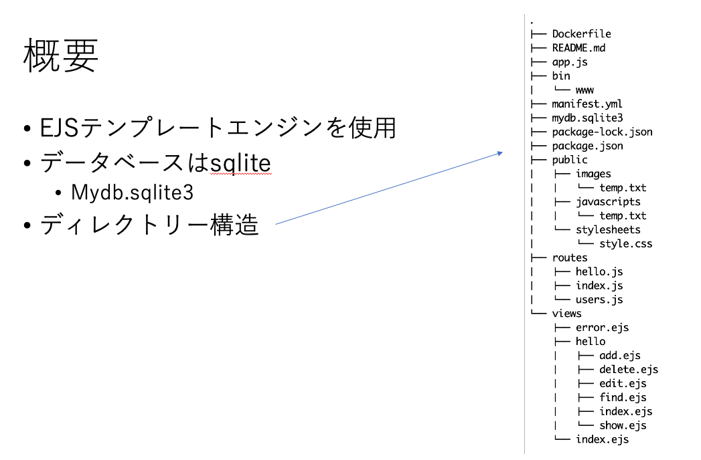
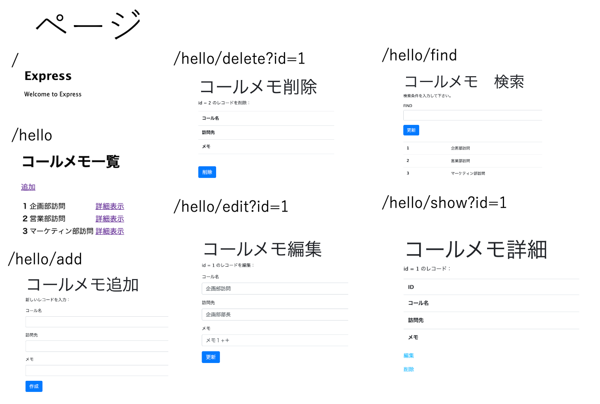
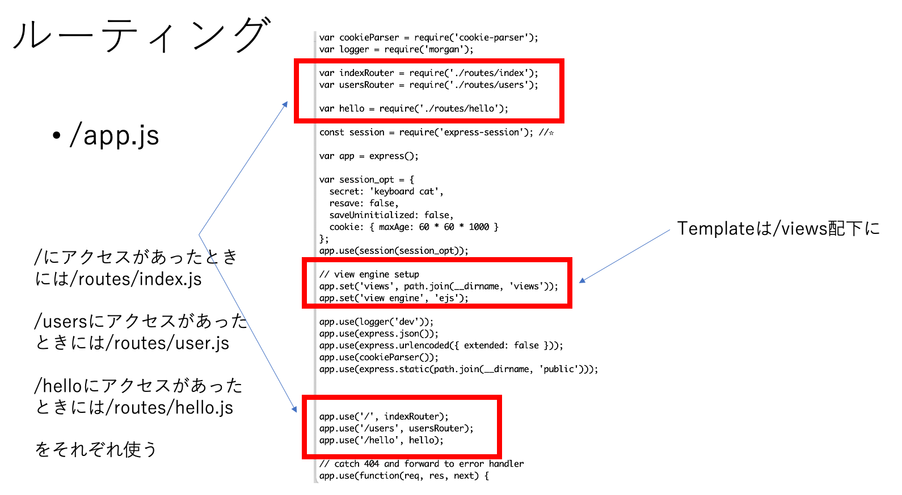
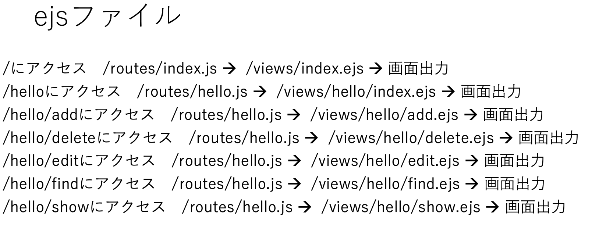
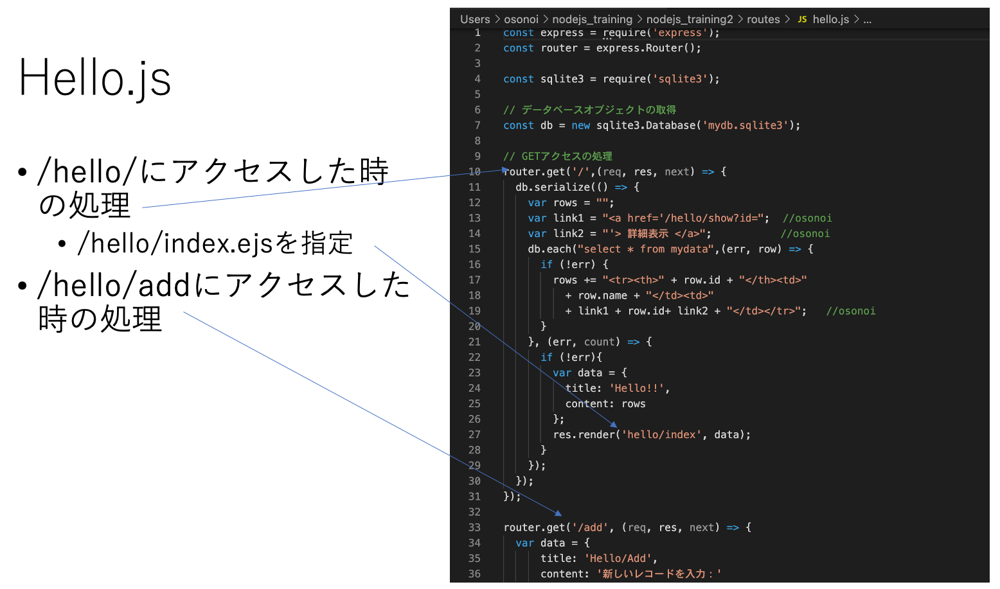

# nodejsを使った入力アプリ
# アプリ例

https://my-nodejs-app-oso20200316-fearless-kob-he.mybluemix.net/hello

# 準備(動作させるまで）

```
$ git clone https://github.com/osonoi/nodejs_training2.git
$ cd nodejs_training2.git
```
### ローカルで動作

```
$ npm install
$ npm start
```
ブラウザーの別タブで　http://localhost:3000
にアクセス

### Cloud foundryで動作

 Manifest.yam のname, "my-nodejs-app"をユニーク（他のものと重ならない）に変更(例　"my-nodejs-app-osonoi20210315")

```
$ ibmcloud login        (シングルサインインの場合は　ibmcloud login --sso)
$ ibmcloud target --cf
$ ibmcloud cf push
```

終了するまで数分お待ちください。終了したら、

```
$ ibmcloud cf apps | grep my-nodejs-app
```
でURLが出てくるのでブラウザーの別タブで表示
出力例
```
$ ibmcloud cf apps | grep my-nodejs-app
my-nodejs-app-osonoi20210315                                          started          1/1            256M       1G         my-nodejs-app-osonoi20210315-brash-crane-wx.mybluemix.net
```
(一番右の my-nodejs-app-osonoi20210315-brash-crane-wx.mybluemix.net がURL)

### OpenShiftで動作
-コンテナーイメージ作成、Docker Hub にアップロード

以下のコマンドでコンテナーイメージを作成
```
$ docker build -t (Docker Hubユーザー名)/node-web-app .
```
ローカルで動作確認する場合は
```
$ docker run -d --rm -p 3000:3000 (Docker Hubユーザー名)/node-web-app
```
動作確認は　http://localhost:3000
でブラウザーの別タブを開いて確認

動作確認したら　$ docker stop (container ID)
で停止しておきましょう。
次にコンテナイメージをDocker Hubにアップロード
```
$ docker login
$ docker push (Docker Hubユーザー名)/node-web-app:latest
```
-OpenShiftで動作
こちらのサイトでOpenShiftのコンソールを立ち上げてください。

https://developer.ibm.com/openlabs/openshift

（やり方はこちらも参考にしてください。）

https://qiita.com/osonoi/items/a5d3a5fe78455c842f42

* 手順<br>
Administrator --> Developer への変更<br>
左メニューから”Add"を選択"Create a project"でプロジェクト作成<br>
任意の名前をつけてプロジェクト作成<br>
Container Imageを選択<br>
"Image name from external registry" に　(Docker Hubユーザー名)/node-web-app　を入力<br>
(OpenShiftが場所を認識すると下に緑文字でValidatedと出る) <br>
下にスクロール"Create"をクリック<br>
数分待つとトポロジー図の縁が青くなるとデプロイ完了右上のアイコンをクリックすると"Open URL"が出て別タブでアプリが起動


# アプリ使い方

<kbd>

<kbd>

<kbd>

<kbd>

<kbd>

<kbd>

